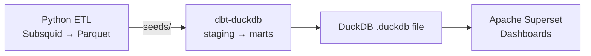

# CCTP Bridge Analytics — dbt + DuckDB + Superset Implementation Plan

## Where You Are Now

```
Python ETL (done)          You are here ──►    Analytics & Dashboard (todo)
─────────────────          ─────────────────    ──────────────────────────────
Subsquid → extract_logs.py                     dbt models → DuckDB → Superset
         → transform_logs.py
         → data/transformed/cctp_transformed_raw_logs.parquet
```

Your Python scripts already produce clean Parquet files with decoded `DepositForBurn` events. The next job is to layer analytics on top using **dbt-duckdb** for modeling and **Apache Superset** for dashboards.

---

## Architecture Overview



**Why this stack?**
- **dbt-duckdb** — SQL-based transformations, version-controlled, testable, zero infrastructure
- **DuckDB** — Blazing fast on Parquet, runs locally, no server needed
- **Superset** — Open-source BI with rich chart types, connects directly to DuckDB

---

## Step-by-Step Plan

### Step 1 · Restructure Project Layout

Reorganize to separate concerns cleanly:

```
circle_cctp_bridge_analytics/
├── src/                          # existing Python ETL (keep as-is)
│   ├── config.py
│   └── ETL/
│       ├── extract/
│       └── transform/
├── data/
│   ├── raw/                      # raw Parquet from extract
│   └── transformed/              # decoded Parquet from transform
├── dbt_project/                  # ◄── NEW: all dbt lives here
│   ├── dbt_project.yml
│   ├── profiles.yml              # local, points to DuckDB file
│   ├── seeds/                    # symlink or copy of transformed parquet
│   ├── models/
│   │   ├── staging/              # 1:1 clean views of source data
│   │   ├── intermediate/         # join/match logic (burn↔mint)
│   │   └── marts/                # final analytical tables
│   ├── tests/                    # data quality tests
│   └── macros/                   # reusable SQL snippets
├── superset/                     # ◄── NEW: Superset config/docker
│   └── docker-compose.yml
├── project_context/
├── CLAUDE.md
└── requirements.txt
```

### Step 2 · Install dbt-duckdb

```bash
pip install dbt-duckdb==1.9.1
```

> [!NOTE]
> `dbt-duckdb` bundles both dbt-core and the DuckDB adapter. One install gets you everything.

### Step 3 · Initialize dbt Project

```bash
cd c:\Users\Longin\Desktop\Projects\circle_cctp_bridge_analytics && dbt init dbt_project --profiles-dir dbt_project
```

Then configure the two key files:

#### `dbt_project/profiles.yml`

```yaml
cctp_analytics:
  target: dev
  outputs:
    dev:
      type: duckdb
      path: ../data/cctp_analytics.duckdb   # single file, zero config
      threads: 4
```

#### `dbt_project/dbt_project.yml`

```yaml
name: cctp_analytics
version: '1.0.0'
profile: cctp_analytics
model-paths: ["models"]
seed-paths: ["seeds"]
test-paths: ["tests"]
macro-paths: ["macros"]

models:
  cctp_analytics:
    staging:
      +materialized: view
    intermediate:
      +materialized: table
    marts:
      +materialized: table
```

### Step 4 · Load Source Data (dbt Sources + External Tables)

Instead of CSV seeds (which are slow for large data), use dbt-duckdb's **external source** feature to read Parquet directly.

#### `dbt_project/models/staging/sources.yml`

```yaml
version: 2

sources:
  - name: raw
    meta:
      external_location: "read_parquet('../../data/transformed/cctp_transformed_raw_logs.parquet')"
    tables:
      - name: cctp_burns
        description: "Decoded DepositForBurn events from Python ETL"
```

### Step 5 · Build dbt Model Layers

This is the core analytics engineering. Three layers, each with a specific purpose:

#### Layer 1 — Staging (`models/staging/`)
Clean, rename, cast. 1:1 with source.

**`stg_cctp_burns.sql`**
```sql
with source as (
    select * from {{ source('raw', 'cctp_burns') }}
)

select
    tx_hash,
    block_number,
    log_index,
    cast(timestamp as timestamp) as burn_timestamp,
    source_chain,
    dest_chain,
    depositor,
    recipient,
    burn_token,
    amount,
    -- derived
    cast(timestamp as date) as burn_date,
    extract(hour from cast(timestamp as timestamp)) as burn_hour
from source
```

#### Layer 2 — Intermediate (`models/intermediate/`)
Business logic joins, matching, enrichment.

**`int_burn_flows.sql`** — Aggregated flow pairs:
```sql
select
    source_chain,
    dest_chain,
    burn_date,
    count(*) as num_transfers,
    sum(amount) as total_volume_usdc,
    avg(amount) as avg_transfer_size,
    count(distinct depositor) as unique_depositors
from {{ ref('stg_cctp_burns') }}
group by source_chain, dest_chain, burn_date
```

#### Layer 3 — Marts (`models/marts/`)
Final tables optimized for dashboard consumption.

**`mart_daily_volume.sql`** — Daily volume by chain:
```sql
select
    burn_date,
    source_chain,
    sum(total_volume_usdc) as daily_volume_usdc,
    sum(num_transfers) as daily_transfers
from {{ ref('int_burn_flows') }}
group by burn_date, source_chain
order by burn_date, daily_volume_usdc desc
```

**`mart_chain_flows.sql`** — Cross-chain flow matrix:
```sql
select
    source_chain,
    dest_chain,
    sum(total_volume_usdc) as total_volume_usdc,
    sum(num_transfers) as total_transfers,
    round(avg(avg_transfer_size), 2) as avg_transfer_size
from {{ ref('int_burn_flows') }}
group by source_chain, dest_chain
order by total_volume_usdc desc
```

**`mart_top_users.sql`** — Whale leaderboard:
```sql
select
    depositor,
    count(*) as num_burns,
    sum(amount) as total_volume_usdc,
    count(distinct dest_chain) as chains_used,
    min(burn_timestamp) as first_seen,
    max(burn_timestamp) as last_seen
from {{ ref('stg_cctp_burns') }}
group by depositor
order by total_volume_usdc desc
limit 100
```

### Step 6 · Add dbt Tests & Documentation

#### `models/staging/schema.yml`
```yaml
version: 2

models:
  - name: stg_cctp_burns
    description: "Cleaned CCTP DepositForBurn events"
    columns:
      - name: tx_hash
        tests: [not_null]
      - name: amount
        tests:
          - not_null
          - dbt_utils.accepted_range:
              min_value: 0
      - name: source_chain
        tests: [not_null]
      - name: dest_chain
        tests: [not_null]
```

Run tests:
```bash
cd dbt_project && dbt test
```

### Step 7 · Run dbt Pipeline

```bash
cd c:\Users\Longin\Desktop\Projects\circle_cctp_bridge_analytics\dbt_project && dbt run && dbt test
```

This creates all tables inside `data/cctp_analytics.duckdb`. You can inspect them:

```bash
python -c "import duckdb; con = duckdb.connect('data/cctp_analytics.duckdb'); print(con.sql('SHOW TABLES').fetchall())"
```

### Step 8 · Set Up Apache Superset (Docker)

> [!IMPORTANT]
> Superset runs in Docker. You need Docker Desktop installed and running.

#### `superset/docker-compose.yml`

```yaml
version: "3.8"
services:
  superset:
    image: apache/superset:latest
    ports:
      - "8088:8088"
    volumes:
      - ../data:/data          # mount DuckDB file into container
      - superset_home:/app/superset_home
    environment:
      - SUPERSET_SECRET_KEY=your-secret-key-change-me
      - TALISMAN_ENABLED=false

volumes:
  superset_home:
```

Start Superset:
```bash
cd c:\Users\Longin\Desktop\Projects\circle_cctp_bridge_analytics\superset && docker-compose up -d
```

Bootstrap Superset (first time only):
```bash
docker exec -it superset-superset-1 bash -c "superset fab create-admin --username admin --firstname Admin --lastname Admin --email admin@localhost --password admin && superset db upgrade && superset init"
```

Install DuckDB driver inside the container:
```bash
docker exec -it superset-superset-1 pip install duckdb-engine
```

### Step 9 · Connect Superset to DuckDB

1. Open `http://localhost:8088` → login `admin` / `admin`
2. Go to **Settings → Database Connections → + Database**
3. SQLAlchemy URI:
   ```
   duckdb:////data/cctp_analytics.duckdb
   ```
4. Test connection → Save

### Step 10 · Build Dashboards

Create these core charts in Superset:

| Chart | Type | Source Table |
|---|---|---|
| Daily USDC Volume | Time-series Line | `mart_daily_volume` |
| Cross-Chain Flow Sankey | Sankey Diagram | `mart_chain_flows` |
| Volume by Source Chain | Pie / Donut | `mart_daily_volume` |
| Top 20 Depositors | Big Number + Table | `mart_top_users` |
| Transfer Size Distribution | Histogram | `stg_cctp_burns` |
| Hourly Heatmap | Calendar Heatmap | `stg_cctp_burns` |

---

## Execution Sequence (Copy-Paste Commands)

```bash
# 1. Install dbt-duckdb
pip install dbt-duckdb==1.9.1

# 2. Init dbt project (from project root)
cd c:\Users\Longin\Desktop\Projects\circle_cctp_bridge_analytics && dbt init dbt_project

# 3. Run your Python ETL first (if not already done)
python -m src.ETL.extract.extract_logs && python -m src.ETL.transform.transform_logs

# 4. Run dbt models
cd dbt_project && dbt run

# 5. Run dbt tests
dbt test

# 6. Start Superset
cd ..\superset && docker-compose up -d

# 7. Bootstrap Superset
docker exec -it superset-superset-1 bash -c "superset fab create-admin --username admin --firstname Admin --lastname Admin --email admin@localhost --password admin && superset db upgrade && superset init"
```

---

## User Review Required

> [!IMPORTANT]
> **Decision: Burn-only vs Burn+Mint analytics**
> Your current ETL only extracts `DepositForBurn` (source-side burn) events. The CLAUDE.md mentions the Match phase (linking burns to `MessageReceived`/`MintAndWithdraw` on destination chains) is still pending. 
> 
> **Do you want to:**
> - **(A)** Proceed with burn-only analytics now (volume, users, flows by destination domain) and add mint-matching later?
> - **(B)** Build the mint-matching Python ETL step first, then set up dbt on top of the complete paired dataset?
> 
> Option A lets you ship dashboards immediately. Option B gives you latency metrics but requires more ETL work first.

> [!IMPORTANT]
> **Decision: Superset deployment**
> Docker-based Superset is the simplest path. Alternatively, if you want to keep everything Python-native and skip Docker, you could use **Streamlit** or **Evidence** for dashboards instead. Which do you prefer?

## Open Questions

1. **Date range**: Your current config covers `2026-03-21` to `2026-03-31`. Do you want the dbt models to support incremental loads for ongoing data, or is this a one-time analysis?
2. **GitHub Pages goal**: The step-by-step guidelines mention building an interactive live graph (like your Across project). Should we plan for a static site export from the dbt marts in parallel, or tackle that after Superset?
